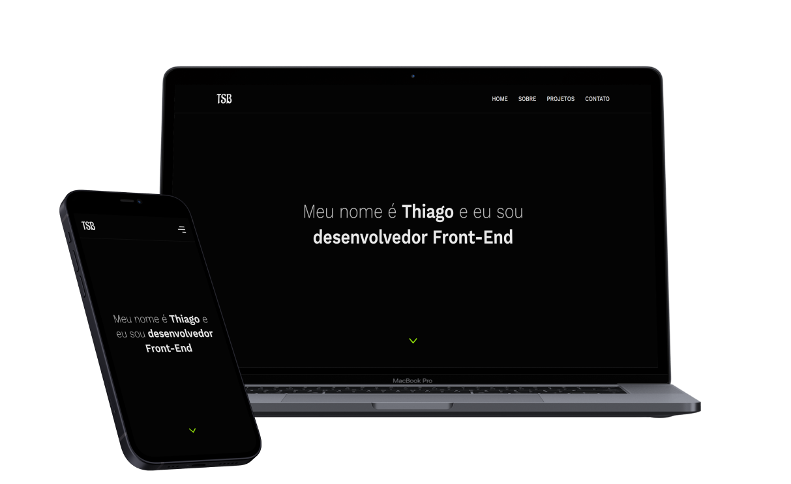

# Portfólio
    

## 💻 Sobre o projeto
Esse projeto é o meu site pessoal onde eu apresento meus projetos, os conhecimentos que possuo e falo um pouco sobre mim. Atualmente ele conta com 5 seções: 
- Home: onde eu faço a apresentação inicial;
- Sobre: onde eu falo um pouco sobre mim, 
- Techs: onde eu mostro as tecnologias que possuo conhecimento.
- Projetos: onde apresento os projetos que eu realizei. 
- Contato: onde possui as informações para entrar em contato comigo.

O projeto está responsivo e para desenvolver eu utilizei: ReactJS, TypeScript, Styled Components, a biblioteca SwiperJS e a ferramenta Figma para criar o design.

## 🚀 Link da página
https://thiagobatista.netlify.app/

## ⚙️ Tecnologias utilizadas
Para desenvolver o projeto eu utilizei:

- ReactJS;
- TypeScript;
- Styled Components;
- SwiperJS;

## 📝 Licença
Este projeto está sob a licença [MIT](https://github.com/ThiagoSantosBatista/Portfolio/blob/main/LICENSE).

***
**Desenvolvido por: [Thiago Batista](https://github.com/ThiagoSantosBatista/).**